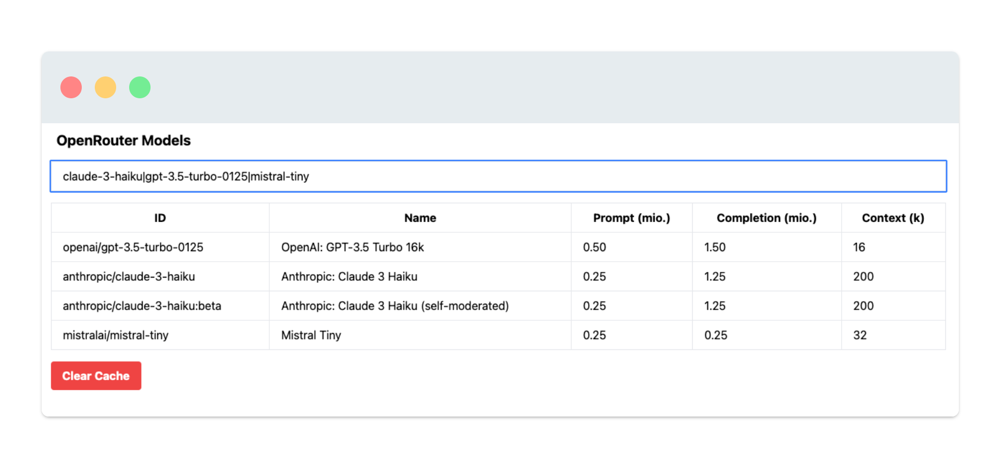

# OpenRouter model comparison

Gets all supported models from OpenRouter API.  
Lets you compare via regex search.  
Caches API response.  
Let's you clear the cache.  
View is not mobile optimized.

**Usage example**  
Local: `open index.html`  
Hosted: `openrouter.martinbetz.eu`  
Filter: `gpt|claude|mistral` to compare matching models.

**Screenshot**  

